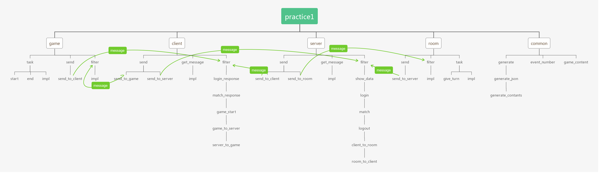
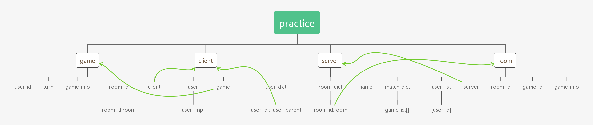

# practice1

#### Introduction

* It is just a project to have fun and practice code

* This practice's point is to implement a game communicate tool and write some basic game.

* At first I want to write a table game with my friends.But I find it can be something more.Maybe we can change game to something others like spider or any work.It may will be interesting.

* In the beginning,I will implement the websocket version and a very little game.  

#### architecture

* 1.communication layer
    * The layer client and server communicate with each other.
    * It just has some functions like login,match,communication.
    * Every way to communicate just need to implement a few functions.

* 2.work layer
    * Work layer need to implement itself.And it can do anything it wants.

* 3.master layer
    * charge if the information from work is right.
    * send message to worker.

#### basic_task

* login task
    * The way to login for client.
   
* match task 
    * Client send match apply message to server.
    * Server set client in wait list.
    * If there are enough workers to do work.
        * 1.server will create a room(master) to manage client
        * 2.room(master) will send `start` command to client
        * 3.client get command and create game(work) from game(work) content

* communicate task
    * worker -> client
    * worker <- client -> server
    * client <- server -> room
    * room -> server

#### model_basic_method

* every model has some basic function:`task`,`send`,`filter`

* task
    * model's task for itself

* send
    * send function to other model

* filter
    * the way to filter which task to do

#### model_basic_argv

#### In the future

* 1.Implement the first version.

* 2.Try many ways for communicating.

* 3.Write some interesting game or work.
