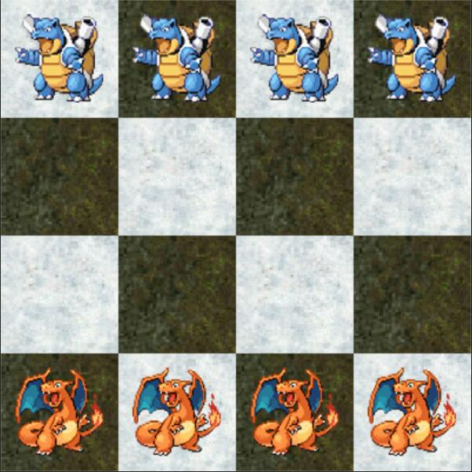

# game content

### four stone

* this is a basic game that every player has four footman to move and attack.

* Players: 2

* Move:
    * 1.Player can move just one footman to an empty block which is next to this footman.
    * 2.Player can just move in player's turn.

* Attack:
    * 1.When two same footman stand side by side,it can attack one block which in the same line and next to one of this two footman.
    * 2.The line should just has one enemy footman.In this way this enemy will be killed.
    * 3.If the line has two enemy footmen,footmen will defend the attack.
